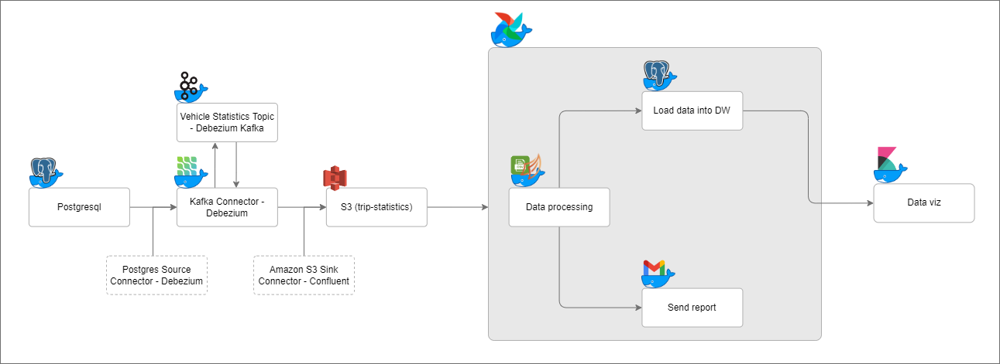
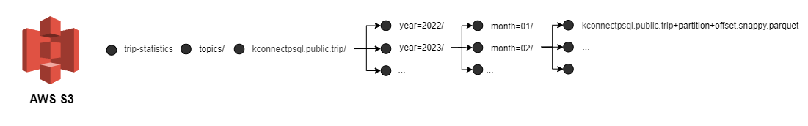
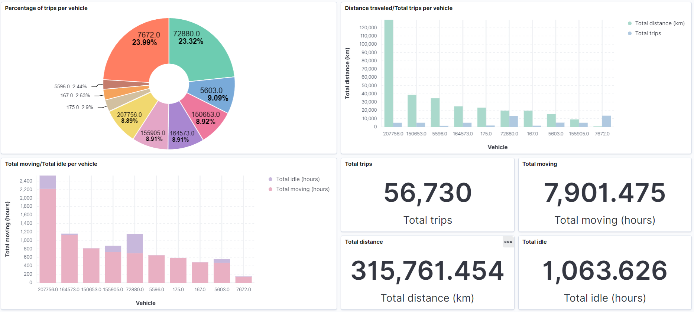

# Trips Data Pipeline

This repository presents a streaming data pipeline using CDC (Change Data Capture), designed to collect, process, and analyze vehicle trip data in real time. The main objective is to provide detailed insights into the performance of each vehicle, including metrics such as the total number of trips made, kilometers traveled, total travel time, and total idle time, aggregated by vehicle and by month.

 

## Requirements
* AWS Account ([sign up](https://aws.amazon.com/pt/free/?trk=eb5111a8-7144-44a0-b89b-294d1572e79e&sc_channel=ps&sc_campaign=acquisition&sc_medium=ACQ-P|PS-GO|Brand|Desktop|SU|Core-Main|Core|BR|EN|Text|PH&s_kwcid=AL!4422!3!507891927296!p!!g!!aws&ef_id=CjwKCAjw9NeXBhAMEiwAbaY4lov5VSOMQRe3mwLVOR3lq0BIXjWjNz9XPqdfNmihktN5Hu2vfoBKfhoC_4gQAvD_BwE:G:s&s_kwcid=AL!4422!3!507891927296!p!!g!!aws&all-free-tier.sort-by=item.additionalFields.SortRank&all-free-tier.sort-order=asc&awsf.Free%20Tier%20Types=*all&awsf.Free%20Tier%20Categories=*all))
* Linux System
* SED
* Make
* Docker

## Skeleton
```
├── /env
|   ├── /airflow
|   |   ├── /logs
|   |   ├── /plugins
|   ├── /app
|   |   ├── /statistic_per_vehicle
|   |   |   ├── /extractor
|   |   |   ├── /loader
|   |   |   ├── /sender
|   ├── /datasource
|   ├── /datawarehouse
|   ├── /kafka
|   |   ├── /connectors
|   |   ├── /libs
|   |   ├── /sink/config
|   |   ├── /source/config
|   ├── /kibana
|   |   ├── /pgsync
├── /imgs
├── /source
|   ├── /app
|   |   |   ├── /dags
|   |   |   ├── /etls
|   |   |   |   ├── /statistic_per_vehicle
|   |   |   |   |   ├── querys
|   |   |   ├── /services
|   |   |   |   ├── /email_sender
|   ├── /data
|   |   |   ├── /statistic_per_vehicle
```

## S3 - Folders Structure 
 

## How to Run:
The steps to set up the environment are a bit complex. ```So be careful```.

1. Create an S3 bucket called ```trip-statistics``` ([Creating a bucket](https://docs.aws.amazon.com/AmazonS3/latest/userguide/create-bucket-overview.html)) with all public acess - AWS Region: us-east-1
2. Fill your email, AWS access key and AWS secrete access key in the ```yourconfig.sh``` file (it's in the root directory of the repository)
3. Finally, with the terminal open in the root directory of the repository, run the following command:
```
$ make
```
* If you want clean your environment run:
```
$ make clean
```

Note: You can individually starts the env components using make command. But keep in mind that some components have dependencies.

With environment up you can access the ```Airflow``` to trigger the statistic per vehicle dag.


* In your browser access the portal through follwing URL:
```
localhost:8080
```

Environment information:
* URI to access the ```data warehouse``` (postgresdb):
```
localhost:3307
```

* ```Data warehouse``` login:
```
user: postgres
password: postgres
```

* Database:
```
mobi7_code_interview
```
* Table:
```
consumer_statistics
```

NOTE: Airflow grid is not showing up on the platform. The reason can see in this [Github](https://github.com/apache/airflow/discussions/23908) thread. The fix forecast is for Airflow version 2.3.2. But if you want the Airflow grid to appear, log in to the platform using the following credentials:

* Airflow login:
```
user: airflow
password: airflow
```

* Analytics dasbhoard:



NOTE: you can create your own Kibana dashboard via the following url:

```
localhost:5601
```
